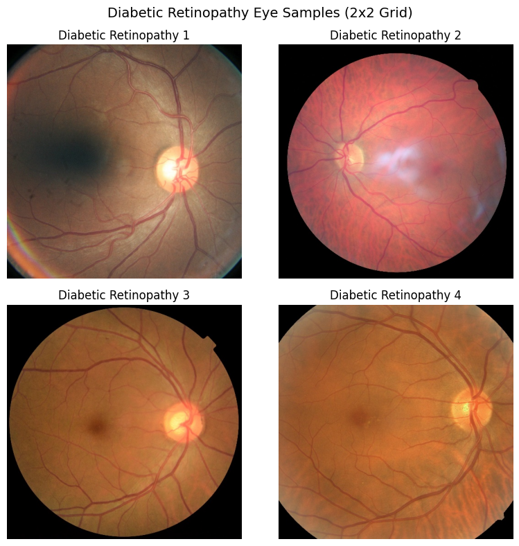
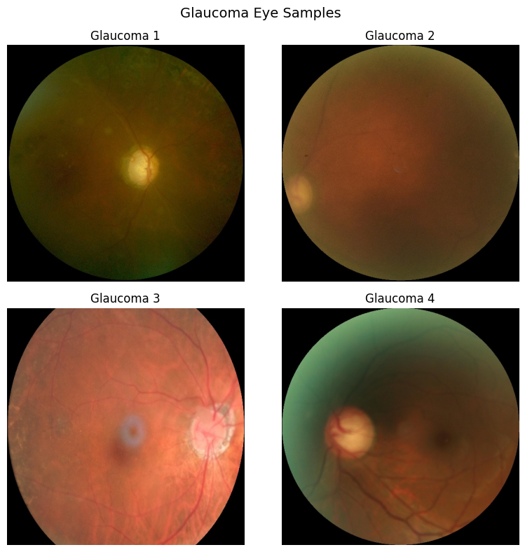
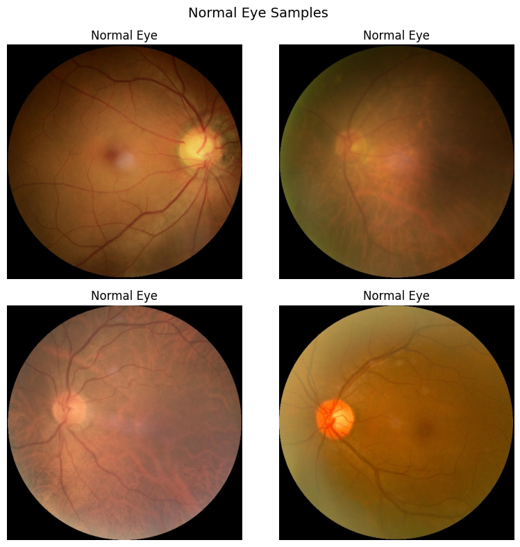
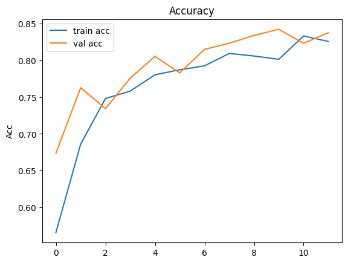

# Overview

The goal of this project was to build a deep learning model using CNN architecture to classify retinal images into four categories — Cataract, Diabetic Retinopathy, Glaucoma, and Normal.
The model aims to detect the presence of any of these eye diseases accurately, supporting faster diagnosis and better treatment planning.

# Problem Statement

Eye diseases such as cataract, glaucoma, and diabetic retinopathy are among the major causes of vision loss worldwide. Manual screening of retinal images is time-consuming and prone to human error.
The project aims to automate this process by training a deep learning model that can accurately classify images based on disease type.

# Dataset

The dataset used in this project was sourced from Kaggle (Eye Diseases Dataset).
It contains labeled retinal images categorized into four classes — Cataract, Diabetic Retinopathy, Glaucoma, and Normal.
All images were resized to 224×224 pixels, normalized, and augmented to handle class imbalance and improve model generalization.
The data was divided into training and validation sets to evaluate model performance effectively .

# Technical Aspects

This project was built using Python.

###  Data Analysis & Modeling

- **Libraries:** TensorFlow, Keras, NumPy, Matplotlib, scikit-learn, OS, glob, random
- **Model Architecture:** EfficientNetB0 (Transfer Learning), CNN Architecture
- **Callbacks:** EarlyStopping and ReduceLROnPlateau to prevent overfitting and stabilize learning
- **Evaluation Metrics:** Accuracy, Precision, Recall, F1-score

# Visualization 

### CNN Accuracy and Loss

### EfficientNetB0 Accuracy and Loss

